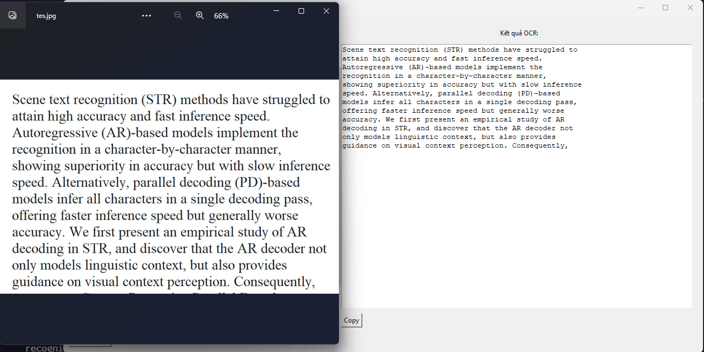

### Trong ví dụ này, chúng ta sử dụng thư viện `tkinterdnd2` để hỗ trợ kéo và thả file.
- Để cài đặt thư viện này, bạn có thể sử dụng lệnh:
```pwh
pip install Pillow pytesseract
pip install tk
pip install tkinterdnd2
```

- ảnh demo <br>

